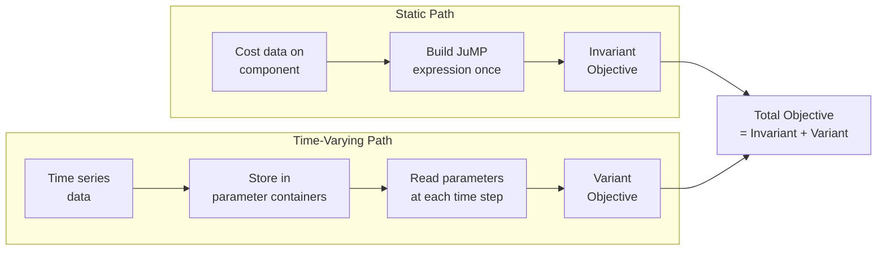
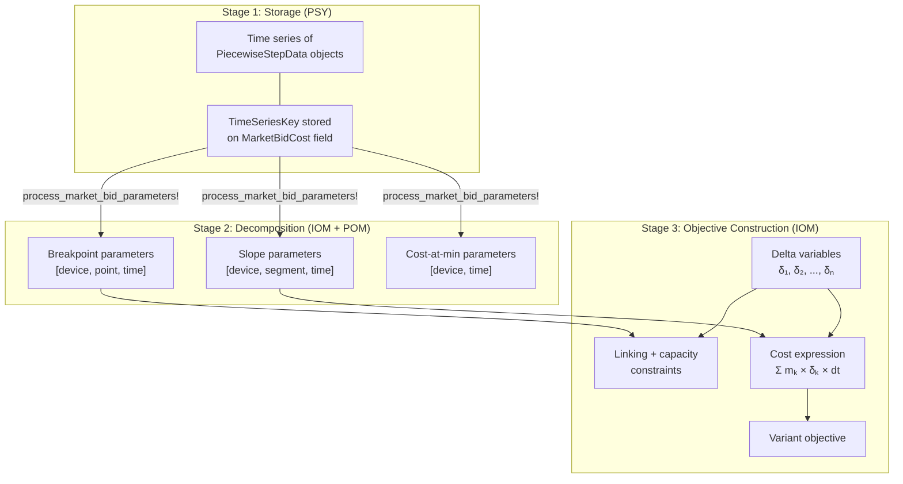
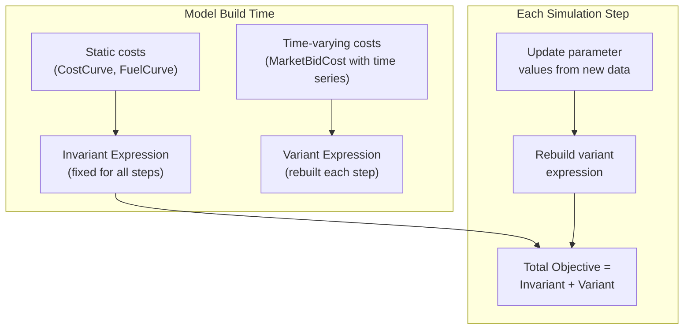
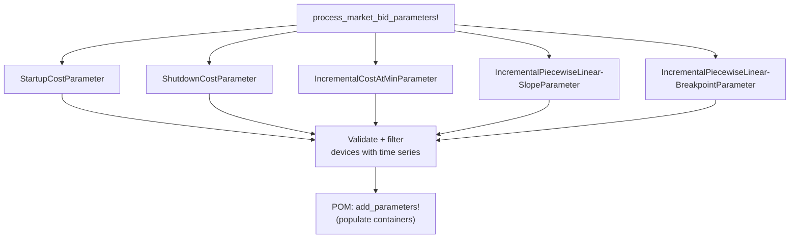
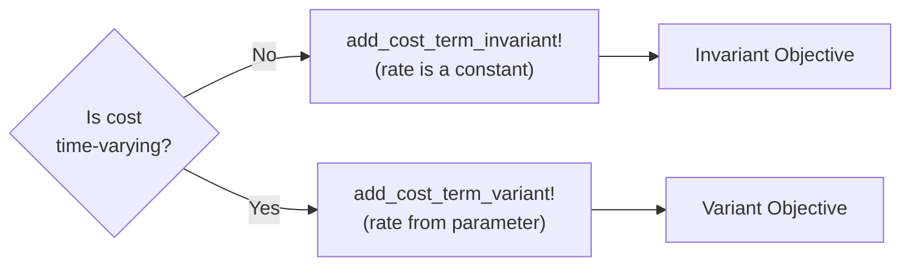
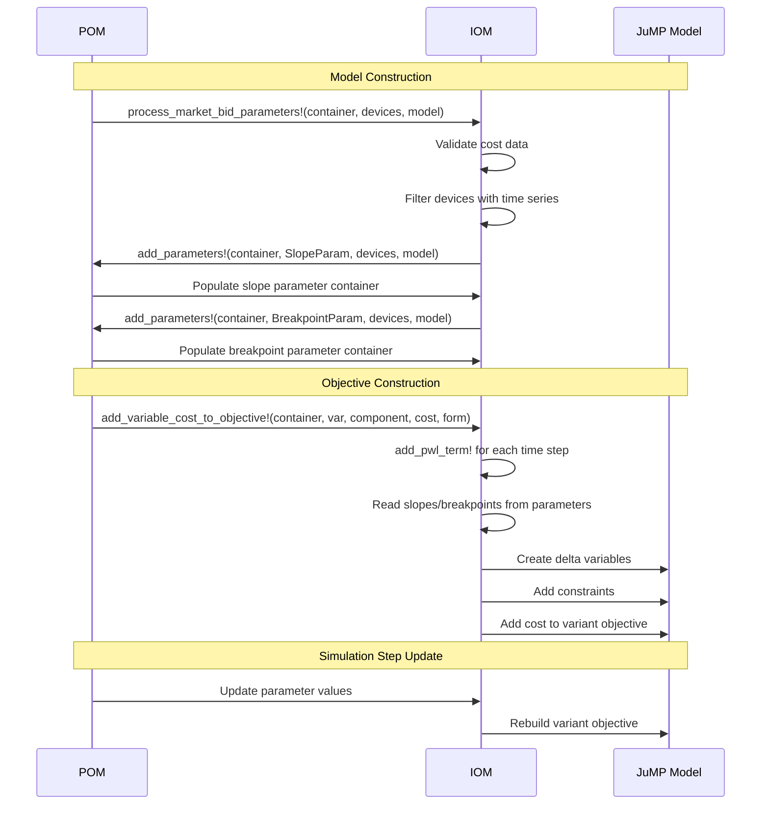

# Time-Varying Objective Functions

```@meta
CurrentModule = InfrastructureOptimizationModels
```

## Overview

In power systems optimization, costs can be either **static** (constant for the entire
simulation) or **time-varying** (changing at each time step). For example:

  - A gas generator might have a **static** heat rate curve that never changes.
  - An electricity market might have **time-varying** offer prices that change every hour
    based on market conditions.

IOM supports both cases. The key difference is how the objective function terms are
stored and updated:

| Property          | Static (Invariant)          | Time-Varying (Variant)           |
|:----------------- |:--------------------------- |:-------------------------------- |
| Cost data source  | Directly from the component | From parameter containers        |
| Objective storage | Invariant expression        | Variant expression               |
| When computed     | Once at model build time    | Rebuilt at each simulation step  |
| Typical use       | `CostCurve`, `FuelCurve`    | `MarketBidCost` with time series |



## How Parameters Enable Time-Varying Costs

When a cost is time-varying, the raw cost data (e.g., slopes and breakpoints of an offer
curve) changes at each time step. IOM stores this data in **parameter containers** — typed
arrays indexed by `[device, time]` or `[device, segment, time]`.

### The Parameter Decomposition Pipeline

Consider a generator with a `MarketBidCost` whose offer curves come from a time series.
The data flows through three stages:



**Stage 1 — Storage:** PSY stores each cost field independently. An offer curve is stored
as a time series of `PiecewiseStepData` objects, each containing slopes and breakpoints
for one time step.

**Stage 2 — Decomposition:** IOM's [`process_market_bid_parameters!`](@ref) orchestrates
the decomposition. For each parameter type, it checks which devices have time series data,
validates the data, and delegates to POM's `add_parameters!` to populate the containers.
POM splits each `PiecewiseStepData` into separate slope and breakpoint arrays for JuMP.

**Stage 3 — Objective Construction:** At each time step, IOM reads the slopes and
breakpoints from the parameter containers and builds the delta PWL objective terms.
Because the data changes per step, the cost expression is added to the **variant**
objective.

## Parameter Types

IOM defines the following parameter types for time-varying offer curve costs:

### Piecewise Linear Parameters

These store the decomposed PWL data from offer curves:

| Parameter Type                                          | Stores                       | Array Axes             | Used For                        |
|:------------------------------------------------------- |:---------------------------- |:---------------------- |:------------------------------- |
| [`IncrementalPiecewiseLinearSlopeParameter`](@ref)      | Marginal rates (slopes)      | `[device, segment, t]` | PWL cost expression             |
| [`IncrementalPiecewiseLinearBreakpointParameter`](@ref) | Power levels (breakpoints)   | `[device, point, t]`   | PWL linking constraints         |
| [`DecrementalPiecewiseLinearSlopeParameter`](@ref)      | Marginal rates (decremental) | `[device, segment, t]` | Decremental PWL cost expression |
| [`DecrementalPiecewiseLinearBreakpointParameter`](@ref) | Power levels (decremental)   | `[device, point, t]`   | Decremental PWL constraints     |

### Scalar Cost Parameters

These store single-valued costs that may vary over time:

| Parameter Type                          | Stores                    | Array Axes    | Used For                      |
|:--------------------------------------- |:------------------------- |:------------- |:----------------------------- |
| [`IncrementalCostAtMinParameter`](@ref) | Cost at minimum power     | `[device, t]` | On-variable proportional cost |
| [`DecrementalCostAtMinParameter`](@ref) | Cost at min (decremental) | `[device, t]` | Decremental on-variable cost  |
| [`StartupCostParameter`](@ref)          | Start-up cost             | `[device, t]` | Start-up cost term            |
| [`ShutdownCostParameter`](@ref)         | Shut-down cost            | `[device, t]` | Shut-down cost term           |
| [`FuelCostParameter`](@ref)             | Fuel price                | `[device, t]` | Fuel curve cost multiplier    |

### How Parameters Are Read

At each time step ``t``, the objective function reads from parameter containers. Each
parameter container has two arrays:

  - **`parameter_array`**: The raw value (e.g., slope in \$/MWh).
  - **`multiplier_array`**: A scaling factor (e.g., for unit conversion).

The effective value is: `parameter_array[name, t] * multiplier_array[name, t]`.

## Invariant vs Variant Objective

The optimization container maintains two separate objective expressions:



**Invariant expression:** Computed once during model construction. Contains cost terms
whose coefficients never change (e.g., a generator with a fixed heat rate curve). These
terms are added via [`add_cost_term_invariant!`](@ref) or
[`add_to_objective_invariant_expression!`](@ref).

**Variant expression:** Rebuilt at each simulation step when parameter values are updated.
Contains cost terms whose coefficients come from time-varying parameters. These terms are
added via [`add_cost_term_variant!`](@ref) or [`add_to_objective_variant_expression!`](@ref).

**Why the split?** In rolling-horizon simulations (e.g., `EmulationModel`), the model is
solved repeatedly with updated data. Invariant terms do not need to be recomputed, saving
time. Only variant terms are cleared and rebuilt with fresh parameter values.

## Time-Varying PWL: End-to-End Example

Consider a thermal generator `"gen1"` with a `MarketBidCost` whose incremental offer
curves come from a time series. Here is the full flow:

### Step 1: Parameter Orchestration

IOM's `process_market_bid_parameters!` is called during model construction:

 1. Filters devices that have `MarketBidCost`.

 2. For each parameter type (slopes, breakpoints, cost-at-min, startup, shutdown):
    
      + Validates the cost data on each device.
      + Checks which devices have time series for that parameter.
      + Calls POM's `add_parameters!` to create and populate the parameter container.



### Step 2: Objective Function Construction

For each time step, `add_pwl_term!` reads from the parameter containers:

 1. **Read data:** Fetches slopes and breakpoints from parameter arrays for device `"gen1"`
    at time ``t``.
 2. **Create variables:** Creates delta variables ``\delta_1, \delta_2, \ldots, \delta_n``
    via `add_pwl_variables!`.
 3. **Add constraints:** Adds linking constraint ``p = \sum \delta_k + P_{\min,\text{offset}}``
    and segment capacity constraints ``\delta_k \leq P_{k+1} - P_k``.
 4. **Build cost:** Computes ``C = \sum m_k \cdot \delta_k \cdot \Delta t`` via
    `get_pwl_cost_expression`.
 5. **Add to variant objective:** Since the slopes come from parameters, the cost expression
    is added to the variant objective.

### Step 3: Simulation Updates

In a rolling-horizon simulation:

 1. New time series data arrives (e.g., updated market prices).
 2. Parameter containers are updated with fresh slope and breakpoint values.
 3. The variant objective expression is cleared and rebuilt.
 4. The model is re-solved with the updated objective.

## Time-Varying Proportional Costs

Not all time-varying costs are piecewise linear. Some are simple proportional
(linear) costs that change over time. For example:

  - **Fuel cost:** A `FuelCurve` with a time-varying fuel price.
  - **On-variable cost:** The cost at minimum generation from a `MarketBidCost`.
  - **Start-up / shut-down costs:** May vary by time step.

These use the scalar parameter types (`FuelCostParameter`, `IncrementalCostAtMinParameter`,
`StartupCostParameter`, `ShutdownCostParameter`) and follow the same variant/invariant
pattern:



For start-up and shut-down costs, the functions [`add_start_up_cost!`](@ref) and
[`add_shut_down_cost!`](@ref) handle the static/time-varying branching automatically.

For proportional costs (e.g., on-variable cost for thermal generators),
[`add_proportional_cost_maybe_time_variant!`](@ref) queries POM's `proportional_cost`
implementation at each time step and routes the result to the appropriate objective
expression.

## The IOM-POM Extension Pattern for Parameters

The parameter system follows an extension pattern where IOM orchestrates and POM
implements:

| Responsibility                         | IOM                                              | POM                                                 |
|:-------------------------------------- |:------------------------------------------------ |:--------------------------------------------------- |
| Define parameter types                 | `IncrementalPiecewiseLinearSlopeParameter`, etc. | —                                                   |
| Orchestrate parameter creation         | `process_market_bid_parameters!`                 | —                                                   |
| Validate device-specific constraints   | Generic validation                               | Device-specific overloads (e.g., multi-start units) |
| Populate parameter containers          | —                                                | `add_parameters!` implementations                   |
| Read parameters during objective build | `add_pwl_term!`, `add_cost_term_variant!`        | —                                                   |
| Determine if cost is time-varying      | —                                                | `is_time_variant_proportional` implementations      |
| Extract proportional cost per step     | —                                                | `proportional_cost` implementations                 |



This separation allows IOM to remain agnostic about specific device types while POM
provides the domain knowledge needed to populate parameters and route costs correctly.
